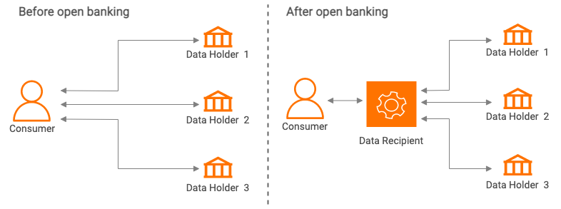

## What is Open Banking?

Open banking is a concept that enables banks, customers, and third parties to use and benefit more from the vast silos 
of data held by banks on their customers. Fundamentally, open banking allows bank customers to share their financial 
data with third parties with their consent. In technical terms, this is done via secure APIs that allow the customers 
or authorized Third Party Provider applications to access data held by the bank. It is envisioned that upon wide 
adoption, an ecosystem of APIs would be created with various third-party applications, services and intermediary platforms
integrating with banks to reinvent financial services using customer data.

This gives customers more control over their data and greater financial transparency. It enables non-banking financial 
service providers and newer entrants such as fintech to participate more actively and meaningfully in generating 
customized user experiences for consumers. Open Banking reshapes the banking industry by encouraging networking of data 
and innovation across various financial institutions.

The **Open Innovation Concept** defined by Henry Chesbrough at Berkley promotes innovation rooted in cooperation with 
external sources to gain a sustainable competitive advantage. This concept contradicts secrecy and siloed methods. 
Open banking stems from this concept.  Then introduced a legal framework known as **PSD1** to promote faster, cheaper and 
more transparent payment services within the European Union (EU) impacting how incumbents operate and promoting the 
entry of new players. **PSD2**, which is the revised version of PSD1 introduced the concept of open banking by regulatory 
means requiring banks across the EU to allow consumers to share their data with authorized third parties. **GDPR** 
introduced a composition to data privacy laws across the EU. GDPR and PSD2 interrelate in terms of consent for data 
sharing and preserving rights of control for consumers over their data. The world has embraced and extended the open 
banking concept according to their requirements. Countries and regions have established their own standards and 
implemented them in phased approaches. Certain countries are experimenting with an extension of open banking, known 
as open finance that enforces data sharing across financial service verticals. In addition to this, there are 
economy-wide data sharing propositions like the Australian CDR.  Economy-wide efforts are now playing out in the 
UK-Smart Data and the EU as well. For more information on current regulations and standards, see 
[open banking regulations and standards](regulations-and-standards.md).

## A sample open banking use case

Open Banking has several use cases and advantages. Here’s one example of how open banking works in practice. 
If you are a customer who is looking for housing loans, open banking can enable a loan comparison service to access 
your financial data so that the service can suggest you the most suitable options based on your financial history.  

Open banking enables customers to view all bank accounts in one place making it easier to manage and budget. 
They also have the benefit of making all their payments using a single Third Party Provider application on behalf 
of them.

## Stakeholders in Open Banking
   
As described in the [Consumer Data Standards](https://consumerdatastandardsaustralia.github.io/standards/#introduction), 
the open banking ecosystem comprises the following main stakeholders:
   
   * **Consumer** - The end-user who has benefited from CDR, the consumer can give permission to the relevant data holder 
   to share their financial data or authorize transactions with the accredited data recipients.

   * **Data Recipient** - A Data Recipient (DR) is an accredited party that can request CDR consumers' data from a 
   Data Holder with the consent of the consumer. Data Recipients use standard APIs to access consumer data to provide 
   services. A Data Recipient needs to be authorized by the ACCC, after successful authorization, an Accredited Data 
   Recipient can request banking data from a Data Holder with the consent of the consumer.

   * **Data Holder** -  The Data Holder is an entity such as a bank that provides and maintains a payment account for 
   consumers. With the consumer's consent, the Data Holders share account and transaction data via secure API endpoints.

   * **Treasury** -  The lead regulatory body for the CDR regime and this organization serves the CDR consumers by 
   creating and imposing rules.
   
   * **ACCC** - The Australian Competition and Consumer Commission (ACCC) is a co-regulator for the CDR regime. The ACCC works 
   with the Treasury, the Data Standards Body and the OAIC to implement the CDR.   The ACCC is responsible for the accreditation 
   of Data Recipients and maintaining a registry of accredited data holders and persons. It also guides stakeholders about
   their rights and obligations under the CDR. For more information, see [ACCC’s roles](https://www.accc.gov.au/focus-areas/consumer-data-right-cdr-0).
   
   * **Merchant** - A vendor who accepts online payments in exchange for their products or services. A merchant can 
   use a single Data Recipient application to accept payments easily from multiple banks. 
   
 There are other stakeholders such as the government, technology providers, and consultancy service providers that 
 are involved in open banking. 

## Customer Stories and Use Cases
WSO2 Open Banking delivers comprehensive technology and strategic consultancy to help you execute 
standards-compliant, commercially successful open banking initiatives. For more information, see our [customer stories 
and use cases](https://wso2.com/solutions/financial/open-banking/#customer-stories-and-use-cases).