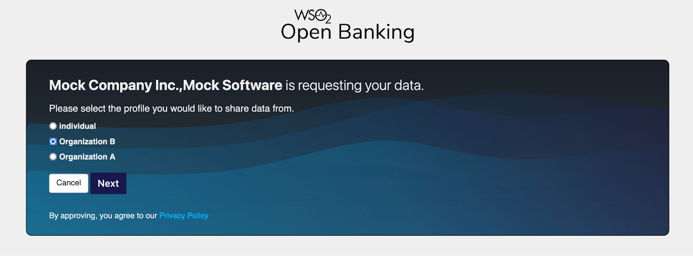

# Enabling the Business User Profile

There are 2 profile types as `individual` and `organization`. Following are the 2 ways to get the profile type and you can configure.

- Enabling the profile selection page

- Profile selection based on the bank's backend response

### Enabling the profile selection page

After a bank customer initiates a consent flow with an Accredited Data Recipient (ADR), they are redirected to the Data Holder’s authentication process. Usually, upon successful authentication, the Data Holder redirects the customer to the account selection step and provides the relevant list of bank accounts the bank customer has the authority to share data.

By default, the profile selection page is disabled. If the profile selection feature is enabled, the bank customer can select the profile as either `business` or `individual` during the consent authorization flow. 

The interface of the profile selection page is shown below.



To enable the profile selection page, follow the steps below:

1. Open the `<IS_HOME>/repository/conf/deployment.toml` file. 

2. Add the below configuration:

    ```toml
    [open_banking_cds.bnr]
    customer_type_selection_method="profile_selection"
    ```      
   
Once the customers select the relevant profile from the profile page, they are redirected to the account selection page which displays the accounts available for the user under the selected organisation.

The interface of the account selection page is shown below.


### Profile selection based on the bank's backend response

The profile can be selected via the bank's backend response. The customer type is retrieved as `individual` or `organization` during the consent authorization flow.

To enable the profile selection from `customer_uType`, follow the steps below:

1. Open the `<IS_HOME>/repository/conf/deployment.toml` file.

2. Add the below configuration:

    ```toml
    [open_banking_cds.bnr]
    customer_type_selection_method="customer_utype"
    ```

# Configuring the deployment.toml file

Follow the steps below to configure the `deployment.toml` file based on your requirements.

1. Open the `<IS_HOME>/repository/conf/deployment.toml` file.

2. Configure the following under the [open_banking_cds.bnr] tag to prioritize getting the permission details in sharable accounts response instead of the stored data in the account metadata table. By default, this is set to true, and the stored permission data will be overwritten when a consent is created.

    ```
    [open_banking_cds.bnr]
    prioritize_sharable_accounts_response=true
    ```

3. Configure the following under the [open_banking_cds.bnr] tag to enable consent revocation when the permissions of the primary user (the user who created the consent) are revoked. After the permission is revoked for the last user with authorized permission for a particular business nominated user account, the consent should be revoked.

    ```toml
    [open_banking_cds.bnr]
    enable_consent_revocation=true
    ```

4. Configure the following under the [open_banking_cds.bnr] tag to validate the business nominated user permissions of the user when retrieving account details. If this is `true`, data of the accounts where the business nominated user permission is revoked for the user will not be returned in the response of the account.

    ```toml
    [open_banking_cds.bnr]
    validate_accounts_on_retrieval=true
    ```
   