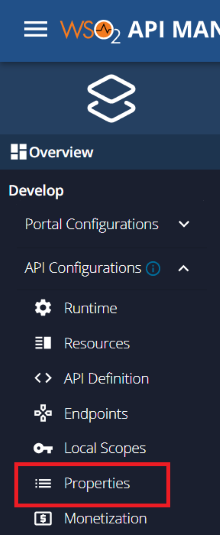
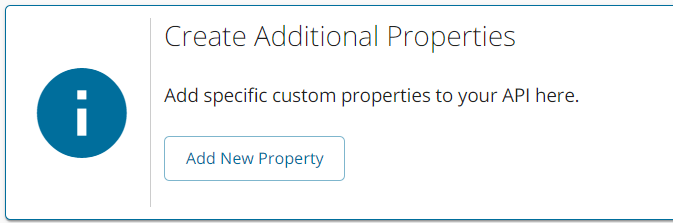

# CDR Arrangement Revocation API

When a customer revokes a granted consent there should be a mechanism to inform relevant parties that the particular CDR 
Arrangement ID is not valid anymore. The Data Recipients use the CDR Arrangement Management API, which facilitates 
this requirement. If this communication does not take place, the Data Holder will continue to expose the customer's 
data and the Data Recipient will continue to have the customer's data within their system. Therefore, it is important 
to communicate the revocation to both parties to protect customer data and prevent misuse.

This page explains how to configure and deploy the CDR Arrangement Management API.
in the latest updates of WSO2 Open Banking.

## Configuring CDR Arrangement Revocation API

!!! tip "Before you begin..."

     1. Open the `<IS_HOME>/repository/conf/deployment.toml` file. 

     2. Configure the event listener tags as follows. These endpoints are used to configure the private key JWT Client Authenticator. 
        ```
         [[event_listener]]
         id = "cds_arrangement_private_key_jwt_authenticator"
         type = "org.wso2.carbon.identity.core.handler.AbstractIdentityHandler"
         name = "com.wso2.openbanking.cds.identity.authenticator.CDSArrangementPrivateKeyJWTClientAuthenticator"
         order = "-13"
         enable = true
          
         [event_listener.properties]
         TokenEndpointAlias = "https://<APIM_HOST>:8243/arrangements/1.0.0"
        ```
     3. Add the given filters and filter mappings to enforce private key JWT client authentication to the CDR Arrangement Revocation endpoint.
        ```
          [[tomcat.filter]]
          name = "PrivateKeyJwtAuthenticationFilter"
          class = "com.wso2.finance.open.banking.identity.extensions.filter.PrivateKeyJwtAuthenticationFilter"
          
          [[tomcat.filter_mapping]]
          name = "TokenFilter"
          url_pattern = "/arrangements/*"
          
          [[tomcat.filter_mapping]]
          name = "PrivateKeyJwtAuthenticationFilter"
          url_pattern = "/arrangements/*"
        ```
     4. Add the following configuration changes to the Data Recipient's consent revocation endpoint.

        ```
        [open_banking.au.recipient_consent_revocation_endpoint]
        enable = true
        
        [open_banking.uk]
        consent_revocation_listener = "com.wso2.finance.open.banking.uk.consent.mgt.listener.AUConsentRevocationListener"
        ```

     5. The `sub` and `iss` claims in the Bearer JWT of the request sent to the Data Recipient's endpoint should be the 
        ID of the Data Holder obtained from the CDR Register. 
        ```
        [open_banking.au.data_holder]
        client_id = "dataholderbrand"
        ```

     6. To persist `recipient_base_uri` as service provider metadata, add the following configuration to the `<APIM_HOME>/repository/conf/deployment.toml` file. 
        ```
        [[apim.devportal.application_attributes]]
        required = false
        hidden = false
        name ="recipient_base_uri_sandbox"
        description = "Recipient Base URI of the sandbox"
        
        [[apim.devportal.application_attributes]]
        required = false
        hidden = false
        name ="recipient_base_uri_production"
        description = "Recipient Base URI of the production"
        ```

### Data Holder Initiated Consent Revocation 

If a consent is withdrawn by a customer via the Data Holder’s Consent Dashboard, the 
Data Holders must notify the Data Recipient of this revocation of the sharing arrangement. This is done by invoking 
the Data Recipient's CDR Arrangement Revocation endpoint with a valid CDR Arrangement ID.

??? tip "Click here to see a sample decoded SSA..."
     The Data Recipients must expose their CDR Arrangement Revocation endpoint under the `recipient_base_uri` claim in their SSA.

      ```
      {
      "iss": "cdr-register",
      "iat": 1571808167,
      "exp": 2147483646,
      "jti": "3bc205a1ebc943fbb624b14fcb241196",
      "legal_entity_id": "3B0B0A7B-3E7B-4A2C-9497-E357A71D07C7",
      "legal_entity_name": "Mock Company Pty Ltd.",
      "org_id": "3B0B0A7B-3E7B-4A2C-9497-E357A71D07C8",
      "org_name": "Mock Company Brand",
      "client_name": "Mock Software",
      "client_description": "A mock software product for testing SSA",
      "client_uri": "https://www.mockcompany.com.au",
      "redirect_uris": [
      "https://www.mockcompany.com.au/redirects/redirect1",
      "https://www.mockcompany.com.au/redirects/redirect2"
      ],
      "sector_identifier_uri": "https://www.mockcompany.com.au/sector_identifier",
      "logo_uri": "https://www.mockcompany.com.au/logos/logo1.png",
      "tos_uri": "https://www.mockcompany.com.au/tos.html",
      "policy_uri": "https://www.mockcompany.com.au/policy.html",
      "jwks_uri": "https://www.mockcompany.com.au/jwks",
      "revocation_uri": "https://www.mockcompany.com.au/revocation",
      "recipient_base_uri": "https://www.mockcompany.com.au",
      "software_id": "740C368F-ECF9-4D29-A2EA-0514A66B0CDE",
      "software_roles": "data-recipient-software-product",
      "scope": "openid profile bank:accounts.basic:read bank:accounts.detail:read bank:transactions:read bank:payees:read bank:regular_payments:read common:customer.basic:read common:customer.detail:read cdr:registration"
      }
      ```

      The Data Recipient's CDR Arrangement Revocation endpoint is `<recipient_base_uri>/arrangements/revoke`. 
      For example, `https://www.mockcompany.com.au/arrangements/revoke`

      - This needs to be done before enabling this feature, using a DCR PUT request.  If the Data Recipients modify this 
        endpoint, they should update their client registrations with each Data Holder as well.

## Deploying the Arrangement Management API

1. Sign in to the API Publisher portal at `https://<APIM_HOST>:9443/publisher` with `creator/publisher` privileges.

    

2. In the homepage, go to **REST API** and select **Import Open API**.

    

3. Select **OpenAPI File/Archive**. 
   
    

4. Click **Browse File to Upload** and select the `<APIM_HOME>/<OB_APIM_TOOLKIT_HOME>/repository/resources/apis/consumerdatastandards.org.au/ArrangementRevocation/cdr-arrangement-mgt-api.yaml` file.

5. Click **Next**.

6. Set the **Endpoint** as follows:
    ```
     https://<IS_HOST>:9446/cdr-arrangement-management/arrangements
    ```
7. Click **Create** to create the API

8. After the API is successfully created, go to **Portal Configurations** using the left menu panel.
   

9. Select **Subscriptions** from the left menu pane and set the business plan to **Unlimited: Allows unlimited requests**.
   

10. Click **Save**.

11. Once you get the message that the API is successfully updated, use the left menu panel and select **API Configurations > Properties**.
    
      

12. Click  **Add New Property**.
      

13. Add the API Properties according to your API and click the **Add** button. 

       | Property Name | Property Value |
       |----------------|------------- |  
       | ob-spec       | au             |
       | ob-api-type   |  cdr-arrangement|

14. Click **SAVE**.

15. Go back to **Overview** using the left menu panel. 

16. Click **PUBLISH**

17. The published API is available in the Developer Portal at `https://<APIM_HOST>:9443/devportal`.

## Consent Amendment History Retrieval

This endpoint is to retrieve the consent amendment history when the CDR Arrangement ID and basic authentication details are provided as a query parameters. For more
details, see [Consent Amendment History](../learn/consent-amendment-history.md).


The Data Holder sends the request to the customer stating the current consent and an array of consent history data objects.
This request is in the format of a URL as follows:

Update the placeholders with relevant values and run the following in a browser to prompt the consent amendment history data.

``` tab="Request"
https://<IS_HOST>:9446/api/openbanking/consent/admin/consent-amendment-history?cdrArrangementID=<CDR_ARRANGEMENT_ID>&UserID=<USER_ID>
```

``` tab="Response"
{
   "consentAmendmentHistory":[
      {
         "amendedTime":1647415438,
         "previousConsentData":{
            "validityPeriod":1678951431,
            "expirationDateTime":"1678951431",
            "clientId":"2ShrqDY9ubabwiV2y1TDYfnn3Aca",
            "userList":[
               {
                  "accountList":[
                     "6500001232"
                  ],
                  "authType":"linked_member",
                  "userId":"ann@gold.com@carbon.super"
               },
               {
                  "accountList":[
                     "6500001232"
                  ],
                  "authType":"linked_member",
                  "userId":"amy@gold.com@carbon.super"
               },
               {
                  "accountList":[
                     "6500001232",
                     "30080012343456"
                  ],
                  "authType":"primary_member",
                  "userId":"admin@wso2.com@carbon.super"
               }
            ],
            "currentStatus":"authorized",
            "permissions":[
               "bank:accounts.basic:read",
               "bank:accounts.detail:read",
               "bank:payees:read",
               "bank:transactions:read",
               "common:customer.detail:read",
               "common:customer.basic:read",
               "bank:regular_payments:read"
            ],
            "createdTimestamp":1647328956,
            "consentType":"CDR_ACCOUNTS",
            "updatedTimestamp":1647415438,
            "sharingDuration":"31536000"
         },
         "historyId":"3eaf52d6-c3d3-41e0-9549-c3a2e175ce8d",
         "amendedReason":"JAMAccountWithdrawal"
      },
      {
         "amendedTime":1647332312,
         "previousConsentData":{
            "validityPeriod":1678868302,
            "expirationDateTime":"1678868302",
            "clientId":"2ShrqDY9ubabwiV2y1TDYfnn3Aca",
            "userList":[
               {
                  "accountList":[
                     "30080012343456"
                  ],
                  "authType":"primary_member",
                  "userId":"admin@wso2.com@carbon.super"
               }
            ],
            "currentStatus":"authorized",
            "permissions":[
               "bank:accounts.basic:read",
               "bank:accounts.detail:read",
               "bank:payees:read",
               "bank:transactions:read",
               "common:customer.detail:read",
               "common:customer.basic:read",
               "bank:regular_payments:read"
            ],
            "createdTimestamp":1647328956,
            "consentType":"CDR_ACCOUNTS",
            "updatedTimestamp":1647332312,
            "sharingDuration":"31536000"
         },
         "historyId":"f63cac1d-fc98-4daf-bd71-3e638cd5b559",
         "amendedReason":"ConsentAmendmentFlow"
      },
      {
         "amendedTime":1647329172,
         "previousConsentData":{
            "validityPeriod":1678865162,
            "expirationDateTime":"1678865162",
            "clientId":"2ShrqDY9ubabwiV2y1TDYfnn3Aca",
            "userList":[
               {
                  "accountList":[
                     "6500001232"
                  ],
                  "authType":"linked_member",
                  "userId":"ann@gold.com@carbon.super"
               }
            }
         }
```

## Revoke a sharing arrangement

This endpoint is to revoke a sharing arrangement (consent) between the Data Holder and the Data Recipient. This endpoint 
must be implemented by both Data Holders and Data Recipients and notify each other when a CDR Arrangement ID is revoked.
A sample request is given below:

``` 
POST https://data.holder.com.au/arrangements/revoke
HTTP/1.1
Host: data.holder.com.au
Content-Type: application/x-www-form-urlencoded
 
client_id=s6BhdRkqt3&
client_assertion_type=urn%3Aietf%3Aparams%3Aoauth%3Aclient-assertion-type%3Ajwt-bearer&
client_assertion=eyJhbGciOiJQUzI1NiIsInR5cCI6IkpXVCIsImtpZCI6IjEyNDU2In0.ey ...&
cdr_arrangement_id=5a1bf696-ee03-408b-b315-97955415d1f0
```