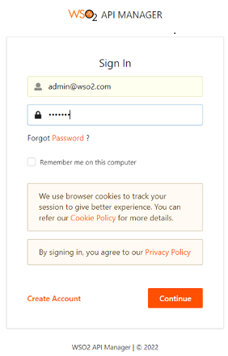
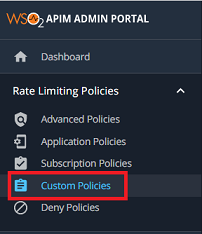
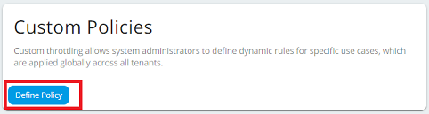
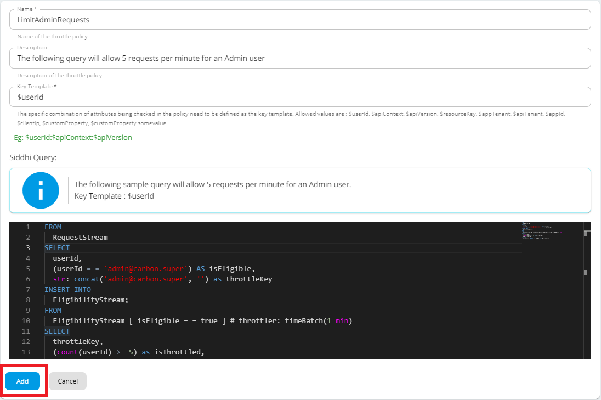

Custom throttling allows system administrators to define dynamic rules for specific use cases. When a custom throttling
policy is created, it is possible to define any policy you like. This feature is required when certain traffic thresholds
need to be freely throttled or rejected by Data Holders without impacting their performance or availability requirements.
For more details on setting the traffic thresholds, refer to [Consumer Data Standards - Traffic Thresholds](https://consumerdatastandardsaustralia.github.io/standards/#traffic-thresholds).

This page explains how to deploy a custom throttling policy for the Consumer Data Standards API.

1. Open the `<APIM_HOME>/repository/deployment/server/synapse-configs/default/api/<USERNAME>--ConsumerDataStandards_vv1.xml` file.

2. Add the **CDS Throttling Policy Handler** in the following order:
   ```
   <handler class="com.wso2.finance.open.banking.custom.throttling.CDSThrottlingPolicyHandler"/>
   <handler class="org.wso2.carbon.apimgt.gateway.handlers.throttling.ThrottleHandler"/>
   ```
3. Sign in to the Admin portal at `https://<APIM_HOST>:9443/admin` with administrator privileges.
       
     

4. Go to **Rate Limiting Policies** and select the **Custom Policies** tab.
     
     

5. To add a new policy, click **Define Policy**.

     

6. Enter the following policy details and click **Add**. 

     


    !!! note
         As shown in the above Siddhi query, the throttle key must match the key template format. If there is a mismatch between 
         the key template format and the throttle key, requests will not be throttled.